## Mini modèle de compétition et tests de coexistence

Ceci est un test de modèle pour dessiner les [hypothèses générales](https://raw.githubusercontent.com/RenaudJau/PEExp/main/hyp_gene.png) de EP. L'idée est de faire un petit modèle de compétition très simplifié pour voir la forme que devrait avoir les grandes zones du schéma (coexistance ou non..). On *modélise* la biomasse des 2 espèces en faisant plusieurs postulats très grossiers (mais c'est vraiment juste pour voir comment ça réagit) :

* Dans les meilleures conditions (pas de compétition et optimum abiotique) : biomasse = 100
* Si la distance à l'optimum est de 10, on retire 10%, donc biomasse  = 90
* Si la compétition exercée par l'autre espèce est de 10, on retire encore 10 à ce qui reste, donc ici biomasse = 80
* On considère qu'il y a coexistence si les 2 espèces ont une biomasse > 0..
* Si le semis est séquencé, l'espèce qui arrive en première subit 2 fois moins de compétition (elle est plus forte..) et elle exerce 2 fois plus de compétition (elle est plus forte j'ai dit..)

*Le raisonnement est très binaire, mais il me semble que pour dessiner les tendances, c'est assez utile..*

*NB : Du coup, j'ai du diviser par deux les effets compétitifs, sinon ils sont strictement symétriques de la distance à l'optimum et il n'y a plus de coexistence..*


```r
#Distance aux optimum de A et B (ils évoluent en sens inverse)
#il y a une répétition pour avoir des points dans les 2 dimensions (équidistance et assymétrie)
DB <- rep(seq(from = 0, to = 100, by = 1),101)
DA <- rep(seq(from = 100, to = 0, by = -1),101) 

#Compétition exercée par A sur B et inversement
CA <- rep(seq(from = 0, to = 50, by = 0.5), each=101)
CB <- rep(seq(from = 50, to = 0, by = -0.5), each=101)

Coexistence_plot2 <- function(DA,DB,CA,CB, xlim=c(-1,2), main = "Effets de priorité", coul = c("#00C3FC","#5AD6FA","#ADDEED","#CFCFCF","#D7CA97","#FFE88C","#FAC901"),...)
{
  #Equidistance
  Equi <- (DB-DA)/(DB+DA)
  
  #Assymétrie :
  Assy <- (CA-CB)/(CB+CA)
  
  #Calcul des biomasses des espèces
  spA <- 100-DA-(CB)
  spB <- 100-DB-(CA)
  
  #Identification des coexistences
  coex <- ifelse(spA > 0 & spB > 0, 1, 0)
  
  #Idem pour A qui arrive en premier :
  spA_A1 <- 100-DA-(0.5*CB)
  spB_A1 <- 100-DB-(1.5*CA)
  
  coex_A1 <- ifelse(spA_A1 > 0 & spB_A1 >0, 1, 0)
  
  #Idem pour B qui arrive en premier :
  spA_B1 <- 100-DA-(1.5*CB)
  spB_B1 <- 100-DB-(0.5*CA)
  
  coex_B1 <- ifelse(spA_B1 > 0 & spB_B1 > 0, 1, 0)
  
  #Identification des situations où il y a coexistence :
  EP2_N <- paste0(coex,coex_B1,coex_A1)
  library(Renaudpack2)
  EP22 <- Remplacer(EP2_N,VALEURS = c("000", "001", "101", "111", "110", "010"),
                   VALEURS_NEW = c("Jamais","Si A1","Sauf B1","Toujours","Sauf A1","Si B1"))
  EP22[EP22=="Jamais"] <- ifelse(spA[EP22=="Jamais"] > 0, "A seule","B seule")
  EP22_col <- Remplacer(EP22, VALEURS = c("B seule", "Si A1","Sauf B1","Toujours", "Sauf A1","Si B1", "A seule"), VALEURS_NEW = coul)
  plot(Equi, Assy, pch = 16, col = EP22_col, xlim = xlim, main = main, ...)
  legend("topright", 
         legend = c("B seule", "Coex. si A 1ere","Coex sauf B 1ere","Toujours coex.", "Coex. sauf A 1ere","Coex. sauf si B 1ere", "A seule"),
         bty = "n", col = coul, pch=16)
}
Coexistence_plot2(DA = DA ,DB = DB, CA = CA, CB = CB, xlim=c(-1,1.5))
```

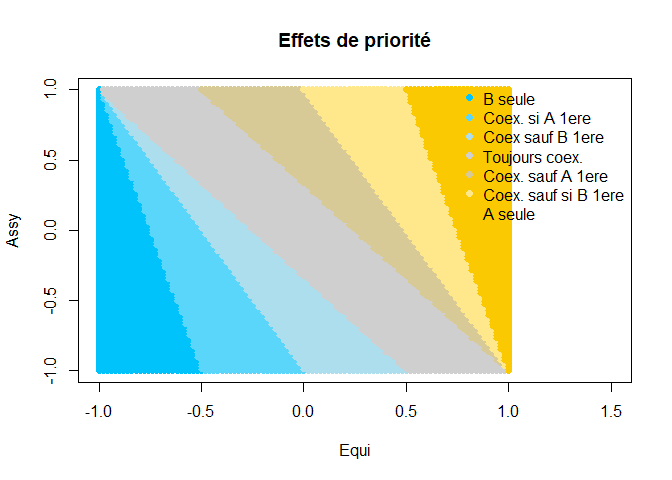<!-- -->

### Tests complémentaires :

Pour simplifier on a mis dans ce premier cas, pour l'assymétrie et l'équidistance à l'optimum, les variations sont symétriques (en gros, pour l'équidistance, pour augmenter l'équidistance on se rapproche de l'optimum d'une espèce autant qu'on s'éloigne de l'optimum de l'autre..). C'est un cas particulier, mais il peut y avoir d'autres cas de figure (qu'on teste ici) : on reste toujours à la même distance à l'optimum d'une espèce - c'est uniquement la distance à l'optimum de l'autre qui bouge (et idem pour la compet..) - l'une augmente, et l'autre augmente plus vite (et idem pour la compet..).

* Avec juste la DA qui est fixe..


```r
Coexistence_plot2(DA = rep(10,10201),DB = DB, CA = CA, CB = CB, xlim=c(-1,1.5), main = "avec DA fixe = 10")
```

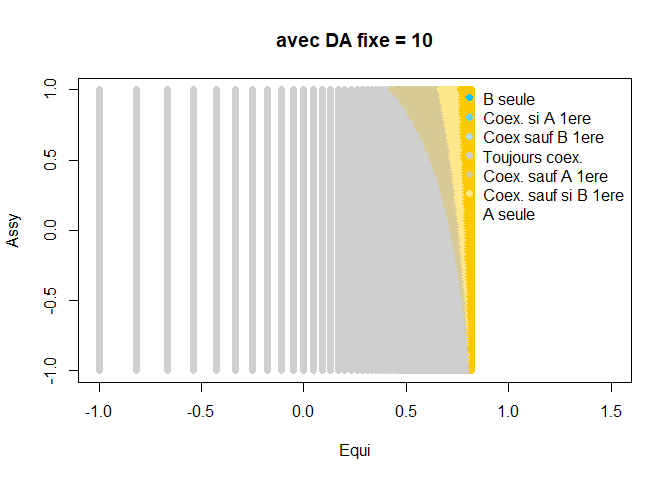<!-- -->

```r
Coexistence_plot2(DA = rep(27,10201),DB = DB, CA = CA, CB = CB, xlim=c(-1,1.5), main = "avec DA fixe = 27")
```

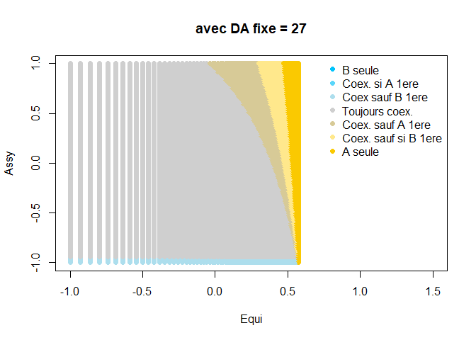<!-- -->

Au delà de 27 : erreur..

* Avec juste la CA qui est fixe et les autres qui varient..


```r
Coexistence_plot2(DA = DA ,DB = DB, CA =  rep(5,10201), CB = CB, xlim=c(-1,1.5), main = "avec CA fixe = 10")
```

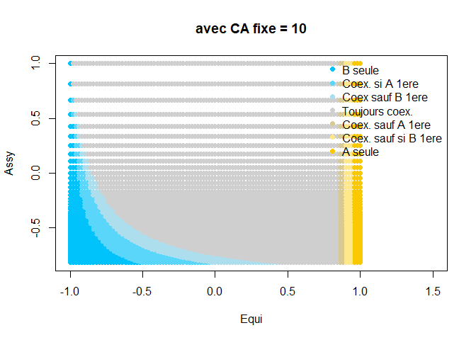<!-- -->

```r
Coexistence_plot2(DA = DA ,DB = DB, CA =  rep(10,10201), CB = CB, xlim=c(-1,1.5), main = "avec CA fixe = 10")
```

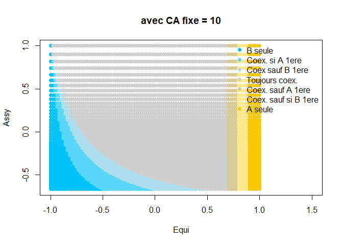<!-- -->

```r
Coexistence_plot2(DA = DA ,DB = DB, CA =  rep(16,10201), CB = CB, xlim=c(-1,1.5), main = "avec CA fixe = 16")
```

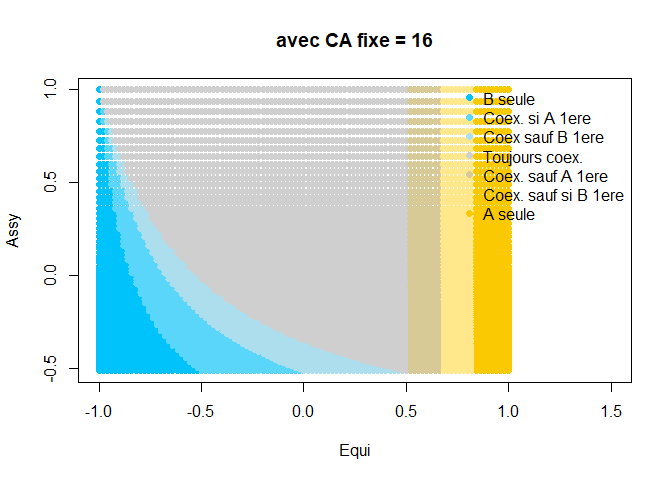<!-- -->

```r
# Ensuite ça bugue..
```

Au delà de 16 : erreur

* Avec DA qui augmente petit à petit et DB qui augmente encore plus :


```r
DA_2 <- rep(seq(from = 15, to = 27, length.out = 101),101) 
Coexistence_plot2(DA = DA_2 ,DB = DB, CA =  CA, CB = CB, xlim=c(-1,1.5), main = "avec DA croissant et DB encore plus croissant")
```

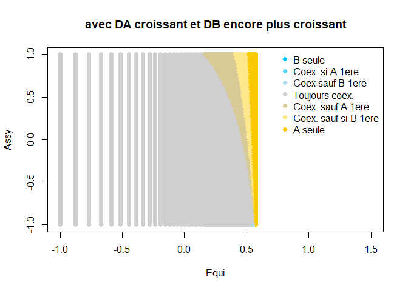<!-- -->

* Avec CB croissant et CA encore plus..


```r
CB_2 <- rep(seq(from = 5, to = 15, length.out = 101), each=101)
Coexistence_plot2(DA = DA ,DB = DB, CA = CA, CB = CB_2, xlim=c(-1,1.5), main = "avec CB croissant de 10 à 40 et CA encore plus croissant")
```

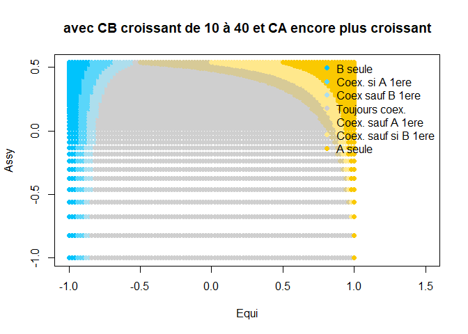<!-- -->


### Premières version, mais on comptait 2 fois l'effet de l'environnement sur l'espèce compétitrice.. 

Calcul de l'équidistance et de l'assymétrie :


```r
#Distance aux optimum de A et B (ils évolulent en sens inverse)
#il y a une répétition pour avoir des points dans les 2 dimensions (équidistance et assymétrie)
DB <- rep(seq(from = 0, to = 100, by = 1),101)
DA <- rep(seq(from = 100, to = 0, by = -1),101) 
#Equidistance
Equi <- (DB-DA)/(DB+DA)

#Compétition exercée par A sur B et inversement
CA <- rep(seq(from = 0, to = 100, by = 1), each=101)
CB <- rep(seq(from = 100, to = 0, by = -1), each=101)
#Assymétrie :
Assy <- (CA-CB)/(CB+CA)
```

Calcul de l'abondance de A et de B :


```r
spA <- 100-DA-(CB*(100-DB)/100)
spB <- 100-DB-(CA*(100-DA)/100)

plot(Equi, Assy, cex = spB/20, col = "blue", main = "Abondance A et B")
points(Equi,Assy, cex = spA/20, col = "#FFC300")
```

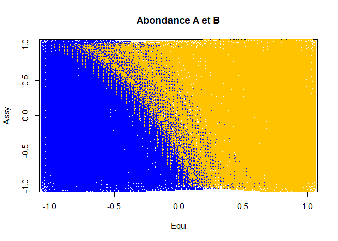<!-- -->

Visualisation coexistence :


```r
coex <- ifelse(spA > 0 & spB > 0, 1, 0)
plot(Equi, Assy, cex = 2*coex, pch = 16, col = 2, main = "coexistence si simultané")
```

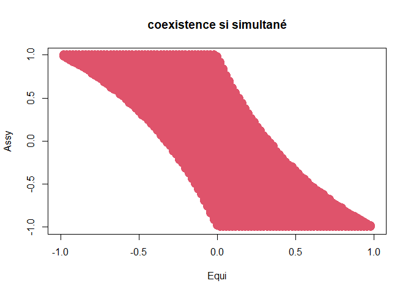<!-- -->

Maintenant si on met de la priorité à une espèce  :


```r
#Si A arrive en premier :

spA_A1 <- 100-DA-(0.5*CB*(100-DB)/100)
spB_A1 <- 100-DB-(1.5*CA*(100-DA)/100)

coex_A1 <- ifelse(spA_A1 > 0 & spB_A1 >0, 1, 0)
plot(Equi, Assy, cex = 2*coex_A1, pch = 16, col = 2, main = "coexistence si A en premier")
```

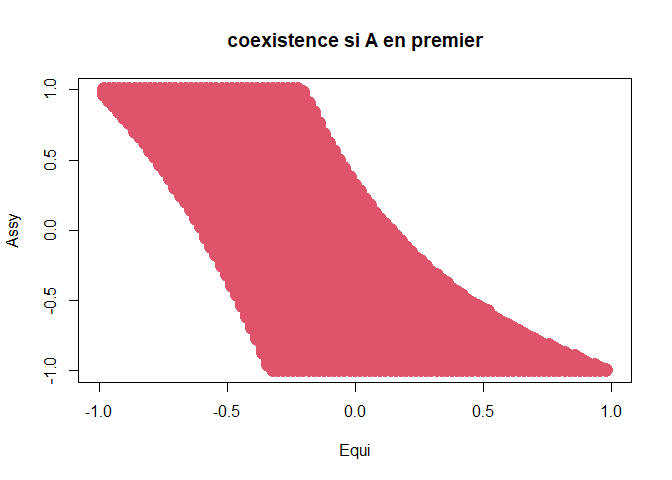<!-- -->

```r
#Si B arrive en premier :

spA_B1 <- 100-DA-(1.5*CB*(100-DB)/100)
spB_B1 <- 100-DB-(0.5*CA*(100-DA)/100)

coex_B1 <- ifelse(spA_B1 > 0 & spB_B1 > 0, 1, 0)
plot(Equi, Assy, cex = 2*coex_B1, pch = 16, col = 2, main = "coexistence si B en premier")
```

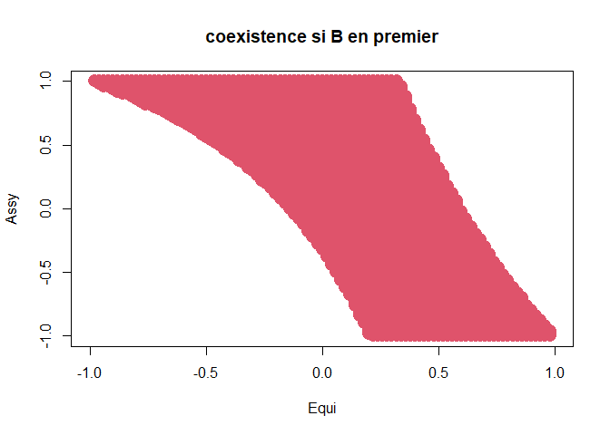<!-- -->

Illustration des différents niveaux d'effets de priorité :


```r
EP2_N <- paste0(coex,coex_B1,coex_A1)
library(Renaudpack2)
EP22 <- Remplacer(EP2_N,VALEURS = c("000", "001", "101", "111", "110", "010"),
                 VALEURS_NEW = c("Jamais","Si A1","Sauf B1","Toujours","Sauf A1","Si B1"))
EP22[EP22=="Jamais"] <- ifelse(spA[EP22=="Jamais"] > 0, "A seule","B seule")

EP22_col <- Remplacer(EP22, VALEURS = c("B seule", "Si A1","Sauf B1","Toujours", "Sauf A1","Si B1", "A seule"),
                      VALEURS_NEW = c("#00C3FC","#5AD6FA","#ADDEED","#CFCFCF","#D7CA97","#FFE88C","#FAC901"))
plot(Equi, Assy, pch = 16, col = EP22_col, xlim = c(-1,2), main = "Effets de priorité")
legend("topright", 
       legend = c("B seule", "Coex. si A 1ere","Coex sauf B 1ere","Toujours coex.", "Coex. sauf A 1ere","Coex. sauf si B 1ere", "A seule"),
       bty = "n", col = c("#00C3FC","#5AD6FA","#ADDEED","#CFCFCF","#D7CA97","#FFE88C","#FAC901"), pch=16)
```

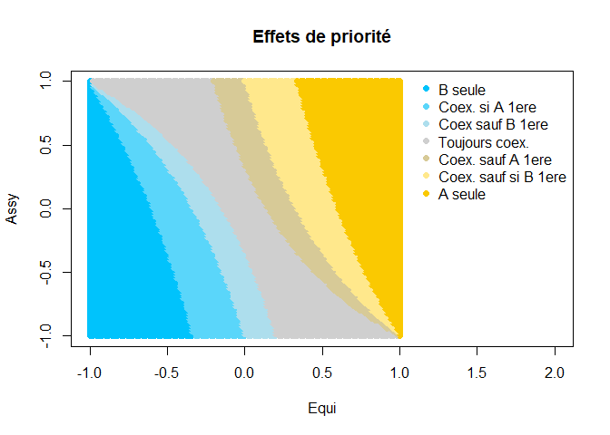<!-- -->

### Essais complémentaires :

Fonction pour jouer :


```r
Coexistence_plot <- function(DA,DB,CA,CB, xlim=c(-1,2), main = "Effets de priorité", coul = c("#00C3FC","#5AD6FA","#ADDEED","#CFCFCF","#D7CA97","#FFE88C","#FAC901"),...)
{
  #Equidistance
  Equi <- (DB-DA)/(DB+DA)
  
  
  #Assymétrie :
  Assy <- (CA-CB)/(CB+CA)
  
  spA <- 100-DA-(CB*(100-DB)/100)
  spB <- 100-DB-(CA*(100-DA)/100)
  
  coex <- ifelse(spA > 0 & spB > 0, 1, 0)
  
  #Si A arrive en premier :
  
  spA_A1 <- 100-DA-(0.5*CB*(100-DB)/100)
  spB_A1 <- 100-DB-(1.5*CA*(100-DA)/100)
  
  coex_A1 <- ifelse(spA_A1 > 0 & spB_A1 >0, 1, 0)
  
  #Si B arrive en premier :
  
  spA_B1 <- 100-DA-(1.5*CB*(100-DB)/100)
  spB_B1 <- 100-DB-(0.5*CA*(100-DA)/100)
  
  coex_B1 <- ifelse(spA_B1 > 0 & spB_B1 > 0, 1, 0)
  
  EP2_N <- paste0(coex,coex_B1,coex_A1)
  library(Renaudpack2)
  EP22 <- Remplacer(EP2_N,VALEURS = c("000", "001", "101", "111", "110", "010"),
                   VALEURS_NEW = c("Jamais","Si A1","Sauf B1","Toujours","Sauf A1","Si B1"))
  EP22[EP22=="Jamais"] <- ifelse(spA[EP22=="Jamais"] > 0, "A seule","B seule")
  
  EP22_col <- Remplacer(EP22, VALEURS = c("B seule", "Si A1","Sauf B1","Toujours", "Sauf A1","Si B1", "A seule"),
                        VALEURS_NEW = coul)
  plot(Equi, Assy, pch = 16, col = EP22_col, xlim = xlim, main = main, ...)
  legend("topright", 
         legend = c("B seule", "Coex. si A 1ere","Coex sauf B 1ere","Toujours coex.", "Coex. sauf A 1ere","Coex. sauf si B 1ere", "A seule"),
         bty = "n", col = coul, pch=16)
}
```

Avec juste la distance DA qui est fixe et les autres qui varient..


```r
Coexistence_plot(DA = rep(10,10201),DB = DB, CA = CA, CB = CB, xlim=c(-1,1.5), main = "avec DA fixe = 10")
```

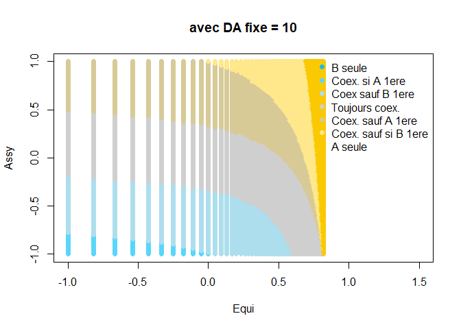<!-- -->

```r
Coexistence_plot(DA = rep(25,10201),DB = DB, CA = CA, CB = CB, xlim=c(-1,1.5), main = "avec DA fixe = 25")
```

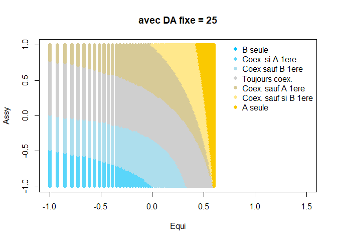<!-- -->

```r
Coexistence_plot(DA = rep(50,10201),DB = DB, CA = CA, CB = CB, xlim=c(-1,1.5), main = "avec DA fixe = 25")
```

<!-- -->

```r
Coexistence_plot(DA = rep(75,10201),DB = DB, CA = CA, CB = CB, xlim=c(-1,1), main = "avec DA fixe = 75")
```

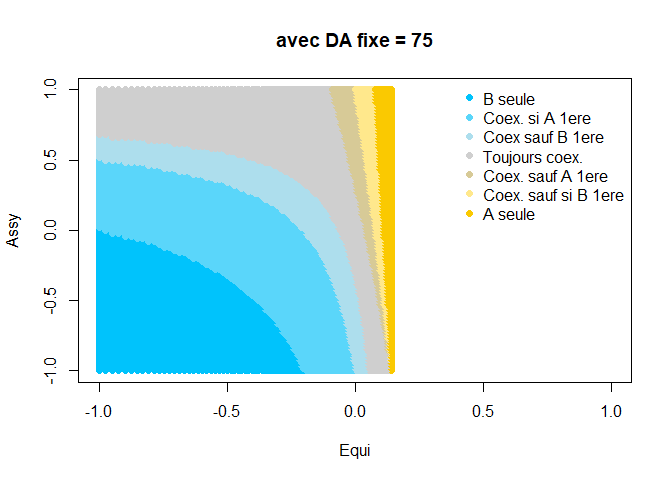<!-- -->

```r
Coexistence_plot(DA = rep(90,10201),DB = DB, CA = CA, CB = CB, xlim=c(-1,0.75), main = "avec DA fixe = 25")
```

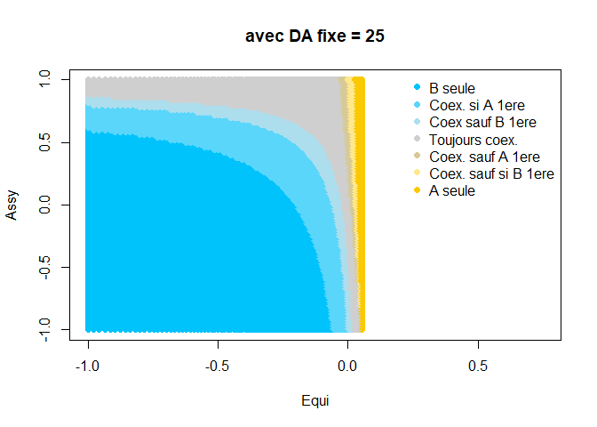<!-- -->

Avec juste la CA qui est fixe et les autres qui varient..


```r
Coexistence_plot(DA = DA ,DB = DB, CA =  rep(10,10201), CB = CB, xlim=c(-1,1.5), main = "avec CA fixe = 10")
```

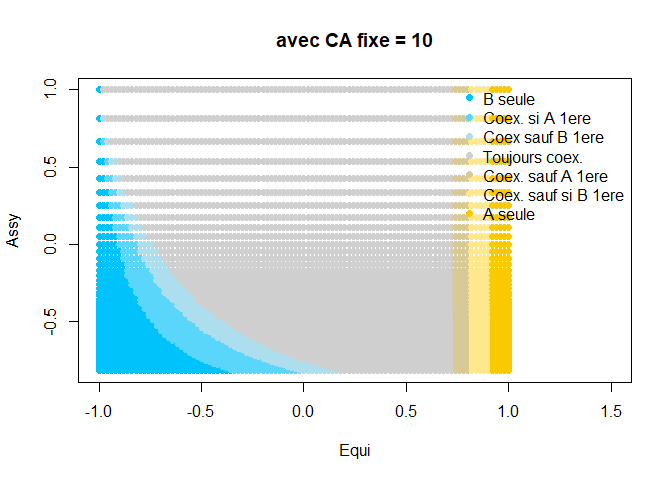<!-- -->

```r
Coexistence_plot(DA = DA ,DB = DB, CA =  rep(25,10201), CB = CB, xlim=c(-1,1.5), main = "avec CA fixe = 25")
```

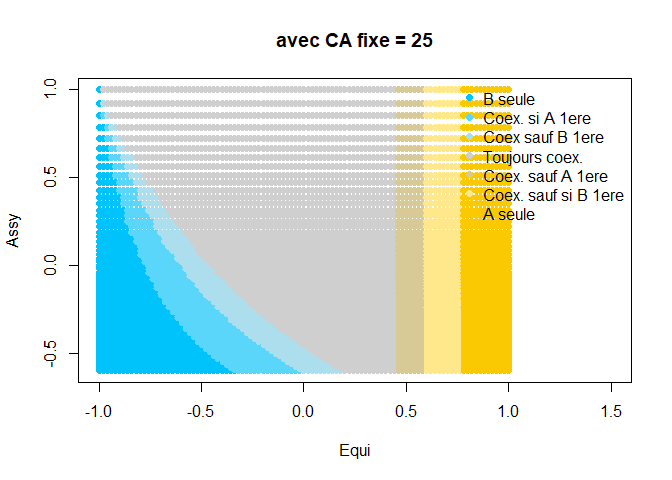<!-- -->

```r
Coexistence_plot(DA = DA ,DB = DB, CA =  rep(44,10201), CB = CB, xlim=c(-1,1.5), main = "avec CA fixe = 44")
```

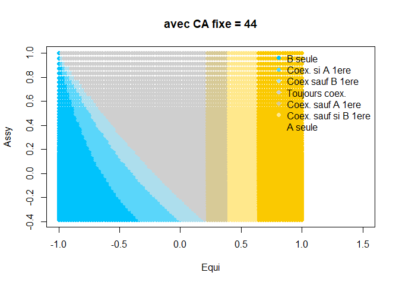<!-- -->

```r
# Ensuite ça bugue..
```

Avec DA qui augmente petit à petit et DB qui augmente encore plus :


```r
DA_2 <- rep(seq(from = 25, to = 75, by = 0.5),101) 
Coexistence_plot(DA = DA_2 ,DB = DB, CA =  CA, CB = CB, xlim=c(-1,1.5), main = "avec DA croissant et DB encore plus croissant")
```

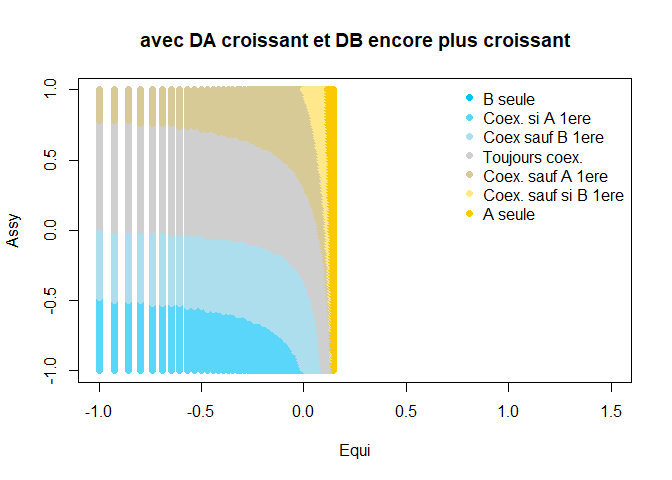<!-- -->

Avec CB croissant et CA encore plus..


```r
CB_2 <- rep(seq(from = 10, to = 40, by = 0.3), each=101)
Coexistence_plot(DA = DA ,DB = DB, CA = CA, CB = CB_2, xlim=c(-1,1.5), main = "avec CB croissant de 10 à 40 et CA encore plus croissant")
```

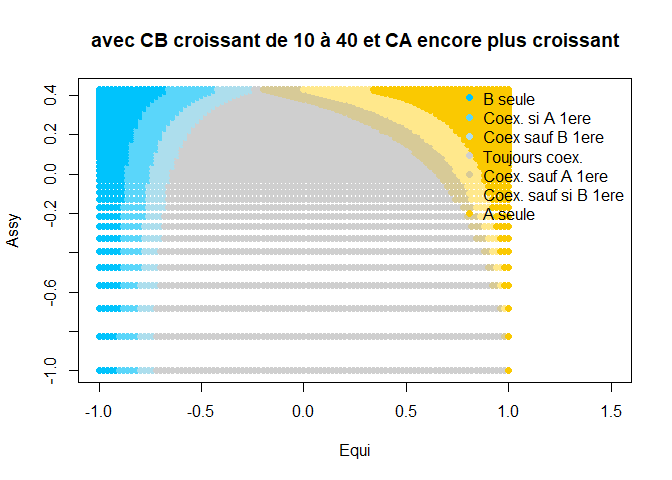<!-- -->

```r
CB_3 <- rep(seq(from = 1, to = 5, length.out = 101), each=101)
Coexistence_plot(DA = DA ,DB = DB, CA = CA, CB = CB_3, xlim=c(-1,1.5), main = "avec  CB croissant de 1 à 5 et CA encore plus croissant")
```

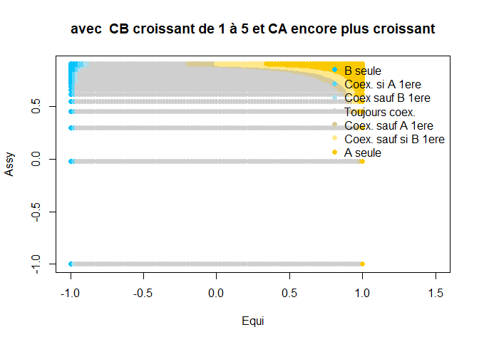<!-- -->
